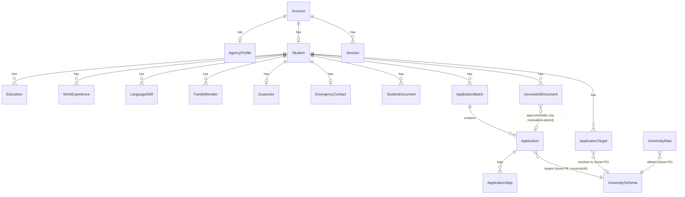
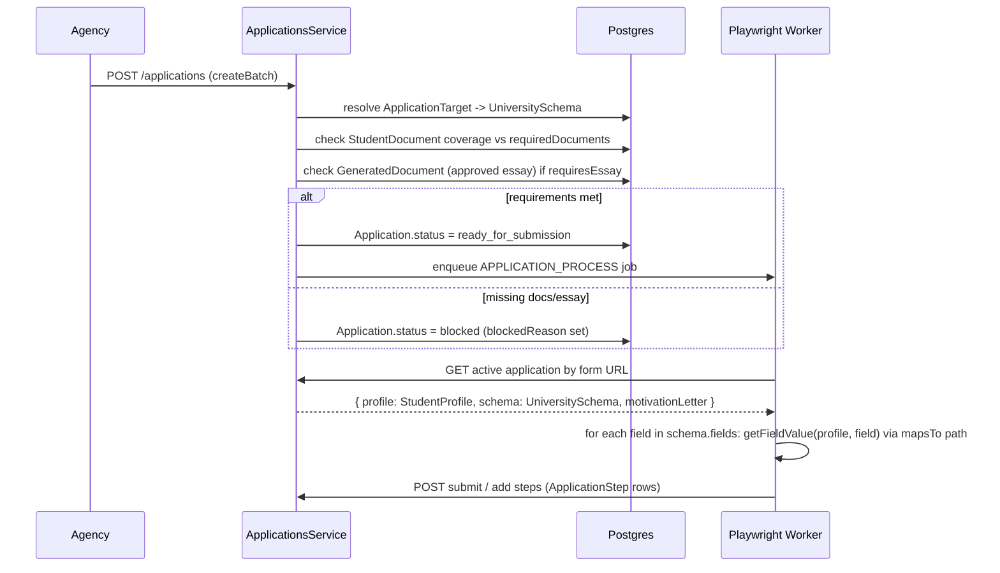

# Entities, Relations & How They Drive the App — 2026-08-10

Source of truth: [`packages/database/prisma/schema.prisma`](../packages/database/prisma/schema.prisma) (18 models). Consumers walked: [`students.service.ts`](../apps/api/src/students/students.service.ts), [`applications.service.ts`](../apps/api/src/applications/applications.service.ts), [`form-filler.ts`](../packages/shared/src/form-filler.ts), [`documents.ts`](../packages/shared/src/documents.ts).

## Overview

Two people create data, one machine consumes it. A **student** fills a 6-step onboarding wizard that writes into `Student` and six child tables. An **agency** account manages students and triggers `ApplicationBatch` → `Application` → `ApplicationStep`, which a Playwright worker drives against real university web forms using `UniversitySchema.fields[].mapsTo` to pull values back out of the student's data by dotted path. Everything is Prisma/Postgres (NestJS API), not the Python/FastAPI stack described in this repo's `.claude/rules/` — those rules don't apply to this codebase.

## Entity-Relationship Diagram

**Note on the loose FKs**: `Application.universityId`, `ApplicationTarget.universityId`, `UniversityAlias.universityId`, and `GeneratedDocument.universityId` are plain `String` columns, not Prisma `@relation` fields — `UniversitySchema.id` is looked up manually in service code (`universitiesService.findOne(...)`), not enforced by Postgres. That's a deliberate seam: university schemas are seeded/versioned data (see `data/university-schemas/*.json`), not something students create, so nothing needs cascade-delete or referential-integrity guarantees against it.

## Two clusters, two lifecycles

| Cluster | Models | Lifecycle |
|---|---|---|
| **Identity** | `Account`, `AgencyProfile`, `Session`, `Student` | Created once at signup; `Student.accountId` links the authenticated account to its profile row (nullable — agency-created students may have no login) |
| **Profile data** | `Education`, `WorkExperience`, `LanguageSkill`, `FamilyMember`, `Guarantor`, `EmergencyContact`, `StudentDocument`, `ApplicationTarget` | Filled incrementally through onboarding; each `PUT /students/me/*` call is a delete-and-recreate of that student's rows, not a diff/merge |
| **Application pipeline** | `ApplicationBatch`, `Application`, `ApplicationStep`, `GeneratedDocument`, `UniversitySchema`, `UniversityAlias` | Created only after profile data exists; driven by the worker + agency actions, not the student |

## Onboarding flow: which column feeds which step

`Student.onboardingStep` (int, default 1) is a **watermark**, not a state machine — `advanceOnboardingStep()` in [students.service.ts:567](../apps/api/src/students/students.service.ts#L567) only ever raises it (`if (currentStep < minStep)`), so re-submitting an earlier step never regresses the wizard the frontend gates on.

| Step | Route | Entity written | Columns |
|---|---|---|---|
| 1→2 | `PUT /students/me` | `Student` (23 scalar columns) | `surname`, `givenName`, `sex`, `nationality`, `cityOfBirth`, `dateOfBirth`, `chineseName`, `religion`, `passportNo`, `passportExpiry`, `consulate`, `maritalStatus`, `email`, `phone`, `hobby`, `permanentAddress`, `postCode`, `currentInstitution`, `beenToChina`, `studiedInChina`, `desiredField` |
| 2→3 | `PUT /students/me/education` | `Education` (0-2 rows) + `LanguageSkill` (0-2 rows) | `Education.level` is either `'school'` or `'higher'` — a string enum documented only in a Prisma triple-slash comment (schema.prisma:93), not a real `enum`. `LanguageSkill.language` is similarly a free string (`'chinese'`/`'english'`), hardcoded at the call site, not user-entered |
| 3→4 | `PUT /students/me/guarantor` | `Guarantor` (financial sponsor, 1:1 with student) | `name`, `relationship`, `nationality`, `company`, `position`, `homeAddress`, `phone`, `email` |
| 4→5 | `PUT /students/me/emergency-contact` | `EmergencyContact` (1:1) | Same shape as `Guarantor` minus `position` |
| 5→6 | `PUT /students/me/family` | `FamilyMember` (0-2 rows: father/mother) | `fullName`, `relationship` (hardcoded `'father'`/`'mother'`), `nationality`, `company`, `position`, `phone`, `email` |

`WorkExperience` exists in the schema and in `getFullProfile()`'s response shape, but **no onboarding route writes it** — it's only populated via the bulk `createFromNormalized()` path (webhook/import ingestion), not the self-service wizard. If you're tracing "why is work history always empty in the UI," that's why — not a bug, a step that was never wired to the wizard.

`StudentDocument` and `ApplicationTarget` are also outside the numbered wizard — documents upload via a separate endpoint (not walked in this pass) and application targets are set by `PUT /students/:id/application-targets` (agency-side, by form URL, not by the student).

## `getFullProfile()` — the read-side join

[students.service.ts:147](../apps/api/src/students/students.service.ts#L147) is the one place all eight profile tables get joined into the `StudentProfile` shape ([student.types.ts](../packages/shared/src/student.types.ts)) that both the frontend and the application pipeline consume. Two non-obvious transforms happen here:

- **`education` gets re-sorted** by `educationRank()` (higher=0, school=1) regardless of insertion order — the wizard writes `higher` then `school`, but this guarantees callers can always assume `education[0]` is the highest degree.
- **`documents` collapses `StudentDocument[]` rows into `Record<type, url | url[]>`** via `groupDocumentUrls()` ([documents.ts:31](../packages/shared/src/documents.ts#L31)), sorted by `sortOrder` then `uploadedAt`. Multi-page docs (transcripts, recommendation letters) become an array under one key; single docs become a bare string. This is why `hasDocument()` and `getFieldValue()` both have to handle "string or array" — it's baked into the wire format, not an edge case.

## University application flow: from columns to a filled-in form

The pivot is `UniversitySchema.fields` — a `Json` column holding an array of `FieldConfig` (defined in [university.types.ts](../packages/shared/src/university.types.ts)), each with a `mapsTo` string or string[] like `"personal.surname"` or `["education.0.institution", "education.1.institution"]`. `getFieldValue()` ([form-filler.ts:31](../packages/shared/src/form-filler.ts#L31)) walks that path against the joined `StudentProfile` object with `getByPath()`, trying each candidate path in order until it finds a non-empty value. This is the entire mapping layer between "23 columns on `Student` plus six child tables" and "300 different university form fields" — no per-university code, just data-driven path lookups. `fieldsForStep()` further slices `schema.fields` by a `wizardStep` number so the worker can page through a multi-step form matching the university's own step grouping (unrelated to `Student.onboardingStep`, despite the similar name).

Gating before a job is even enqueued:
- **`ApplicationTarget.universityId` must be resolved** — raw text the student/agency typed (`universityRaw`) gets matched to a real `UniversitySchema.id` via `UniversitiesService.resolve()`/`resolveByFormUrl()`; unresolved targets short-circuit into a notification instead of an `Application` row.
- **`requiredDocuments` (Json on `UniversitySchema`) vs `StudentDocument` coverage** — computed with `hasDocument()`, not a DB constraint.
- **`requiresEssay` vs an approved `GeneratedDocument`** — `GeneratedDocument.approvedByConsultant` must be `true`; the query orders by `approvedAt desc` and takes the latest, so multiple generated drafts are fine — only the newest approved one is used, and `Application.motivationLetterId` freezes that choice at batch-creation time even if a newer letter gets approved later.

`ApplicationStep` is an append-only audit log per `Application` (`validate_requirements`, `extension_ready`, `consultant_submit`, plus whatever the worker posts via `addStep()`) — it's what the batch/application status views replay to show progress, not a separate state machine.

## Non-obvious design choices worth knowing

- **Delete-then-recreate, not upsert-per-row**, for every one-to-many onboarding table (`Education`, `LanguageSkill`, `FamilyMember`). Each save wraps a `deleteMany` + `createMany` in `$transaction`. Simpler than diffing rows, but it means row `id`s for these children are never stable across a student's edits — never store a foreign key against an `Education.id` from client state and expect it to survive a re-save.
- **Two "family" input shapes exist** (`familyMembers[]` array vs `family.father`/`family.mother` object) — `parseFamilyMembers()` prefers the array if present, only falling back to the object shape otherwise. That's `createFromNormalized()` (bulk import) supporting both a generic form schema and Google Forms' fixed father/mother fields; the self-service wizard (`upsertMyFamily`) only ever uses the object shape.
- **`beenToChina`/`studiedInChina` parse loose truthy strings** (`toBoolean()`) including bilingual Google Forms options like `"Да / Yes"` via regex — a residue of the data source (Google Forms webhook import) leaking into the API layer rather than being normalized at ingestion.
